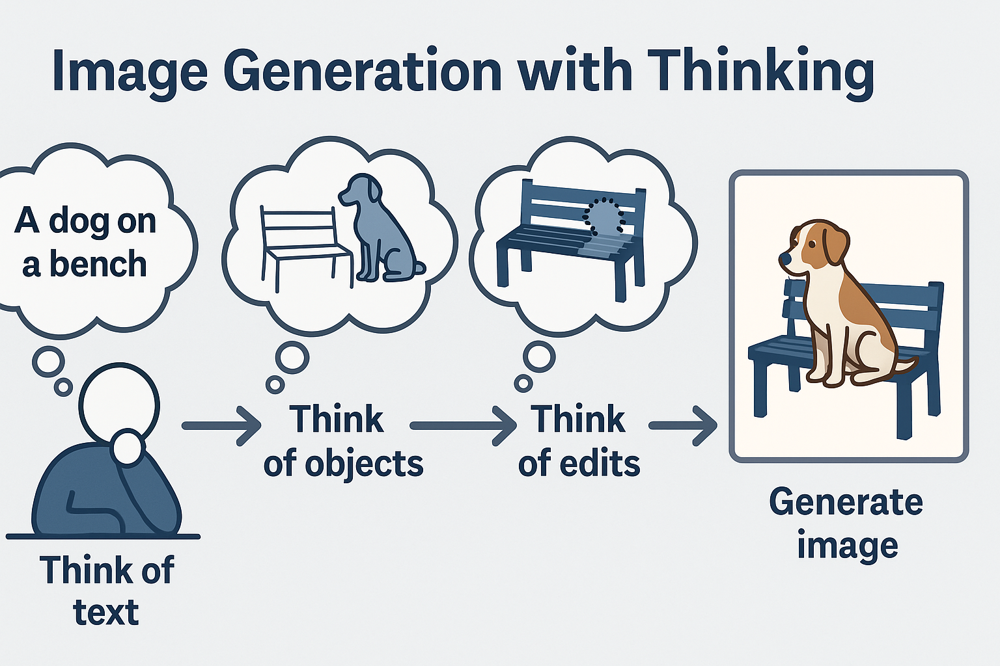

# 💡🎞️ Awesome_Image_Generation_with_Thinking

  
  <h1 align="center">Image Generation with Thinking.</h1>
  
 

 

Welcome to the Awesome-Image-Generation-with-Thinking repository! This repository represents a comprehensive collection of research focused on empowering models to think during image generation. We delve into how these sophisticated models are evolving beyond mere pattern recognition, acquiring capabilities for intricate reasoning, nuanced understanding, and dynamic interaction by processing and interpreting visual information in cognitive-inspired ways.

This collection is for researchers, developers, and enthusiasts eager to explore the forefront of:
*   **Prompt-Based Innovation:** How LVLMs can guide visual understanding and generation.
*   **Supervised Fine-Tuning:** Training models with rich, contextual visual data.
*   **Reinforcement Learning:** Enabling agents to learn through visual interaction and feedback.

---

## 🔔 News

- [2025-06] We created this repository to maintain a paper list on Awesome-Think-With-Images. Contributions are welcome!

- [2025-05] We are excited to release **[OpenThinkIMG](https://github.com/OpenThinkIMG/OpenThinkIMG)**, the first dedicated end-to-end open-source framework designed to empower LVLMs to truly **think with images**! For ease of use, we've configured a Docker environment. We warmly invite the community to explore, use, and contribute.

---

## 📜 Table of Contents

*   [✍️ Editing-based explicitly reflection](#-editing-based-explicitly-reflection)
*   [🗒️ Reasoning with prompt](#-reasoning-with-prompt)
*   [🏆 RL for self-evolution](#-RL-for-self-evolution)
*   [📚 Benchmarks](#-benchmarks)

---

## 📖 Survey

- [Delving into RL for image generation with CoT: A study on DPO vs. GRPO](https://arxiv.org/abs/2505.17017) (May, 2025)  

## 🚀 Editing-based explicitly reflection

Unlocking visual intelligence through the art and science of prompting. These methods explore how carefully crafted textual or visual cues can guide LVLMs to perform complex reasoning tasks with images, often without explicit task-specific training.

- [Visual programming: Compositional visual reasoning without training](https://arxiv.org/abs/2211.11559) (CVPR, 2023)  

- [ViperGPT: Visual inference via python execution for reasoning](https://arxiv.org/abs/2303.08128) (ICCV, 2023)  

- [From reflection to perfection: Scaling inference-time optimization for text-to-image diffusion models via reflection tuning](https://arxiv.org/abs/2504.16080) (Apr., 2025)  

- [GoT: Unleashing reasoning capability of multimodal large language model for visual generation and editing](https://arxiv.org/abs/2503.10639) (Mar., 2025)  

- [Visual planning: Let's think only with images](https://arxiv.org/abs/2505.11409) (Mar., 2025)  

## 🏆 RL for Self-Evolution

Harnessing the power of Reinforcement Learning to teach models how to reason with images through trial, error, and reward. These approaches enable agents to learn complex visual behaviors, tool interactions, and even intrinsic motivation for exploration.

- [Can we generate images with CoT? Let’s verify and reinforce image generation step by step](https://arxiv.org/abs/2501.13926) (Jan., 2025)  

- [ImageGen-CoT: Enhancing text-to-image in-context learning with chain-of-thought reasoning](https://arxiv.org/abs/2503.19312) (Jan., 2025)  

- [SimpleAR: Pushing the frontier of autoregressive visual generation through pretraining, SFT, and RL](https://arxiv.org/abs/2504.11455) (Apr., 2025)  

- [T2I-R1: Reinforcing image generation with collaborative semantic-level and token-level CoT](https://arxiv.org/abs/2505.00703) (May, 2025)  

- [Flow-GRPO: Training flow matching models via online RL](https://arxiv.org/abs/2505.05470) (May, 2025)  

- [DanceGRPO: Unleashing GRPO on visual generation](https://arxiv.org/abs/2505.07818) (May, 2025)  

- [GoT-R1: Unleashing reasoning capability of MLLM for visual generation with reinforcement learning](https://arxiv.org/abs/2505.17022) (May, 2025)  

- [Co-Reinforcement learning for unified multimodal understanding and generation](https://arxiv.org/abs/2505.17534) (May, 2025)  

- [ReasonGen-R1: CoT for autoregressive image generation model through SFT and RL](https://arxiv.org/abs/2505.24875) (May, 2025)  

---

## 🎓 Reasoning with prompt

Tailoring pre-trained models for visual reasoning through targeted fine-tuning on specialized datasets. This approach leverages instruction-following data and demonstrations of reasoning steps to enhance model capabilities.

- [Multi-modal generation via cross-modal in-context learning](https://arxiv.org/abs/2405.18304) (May, 2024)  

- [Emu: Generative pretraining in multimodality](https://arxiv.org/abs/2307.05222) (ICLR, 2024)  

- [DreamLLM: Synergistic multimodal comprehension and creation](https://arxiv.org/abs/2309.11499) (ICLR, 2024)  

- [Making LLaMA see and draw with seed tokenizer](https://arxiv.org/abs/2310.01218) (ICLR, 2024)  

- [MiniGPT-5: Interleaved vision-and-language generation via generative vokens](https://arxiv.org/abs/2310.02239) (Mar., 2024)  

- [Generative multimodal models are in-context learners](https://arxiv.org/abs/2312.13286) (CVPR, 2024)  

- [Unified-IO 2: Scaling autoregressive multimodal models with vision, language, audio, and action](https://arxiv.org/abs/2312.17172) (CVPR, 2024)  

- [SEED-X: Multimodal models with unified multi-granularity comprehension and generation](https://arxiv.org/abs/2404.14396) (May, 2025)  

- [Chameleon: Mixed-Modal early-fusion foundation models](https://arxiv.org/abs/2404.14396) (May, 2025)  

- [Transfusion: Predict the next token and diffuse images with one multi-modal model](https://arxiv.org/abs/2408.11039) (Aug., 2024)  

- [Show-o: One single transformer to unify multimodal understanding and generation](https://arxiv.org/abs/2408.12528) (ICLR, 2025)  

- [VILA-U: A unified foundation model integrating visual understanding and generation](https://arxiv.org/abs/2409.04429) (Mar., 2025)  

- [Emu3: Next-token prediction is all you need](https://arxiv.org/abs/2409.18869) (Sep., 2024)  

- [Janus: Decoupling visual encoding for unified multimodal understanding and generation](https://arxiv.org/abs/2410.13848) (Oct., 2024)  

- [JanusFlow: Harmonizing autoregression and rectified flow for unified multimodal understanding and generation](https://arxiv.org/abs/2411.07975) (Mar., 2025)  

- [TokenFlow: Unified image tokenizer for multimodal understanding and generation](https://arxiv.org/abs/2412.03069) (CVPR, 2025)  

- [MetaMorph: Multimodal understanding and generation via instruction tuning](https://arxiv.org/abs/2412.14164) (Dec., 2024)  

- [LMFusion: Adapting pretrained language models for multimodal generation](https://arxiv.org/abs/2412.15188) (Feb., 2025)  

- [Janus-Pro: Unified multimodal understanding and generation with data and model scaling](https://arxiv.org/abs/2501.17811) (Jan., 2025)  

- [MINT: Multi-modal chain of thought in unified generative models for enhanced image generation](https://arxiv.org/abs/2503.01298) (Mar., 2025)  

- [Transfer between modalities with metaqueries](https://arxiv.org/abs/2504.06256) (Apr., 2025)  

- [BLIP3-o: A family of fully open unified multimodal models-architecture, training and dataset](https://arxiv.org/abs/2505.09568) (May, 2025)  

- [Emerging properties in unified multimodal pretraining](https://arxiv.org/abs/2505.14683) (May, 2025)  

- [Thinking with generated images](https://arxiv.org/abs/2505.22525) (May, 2025)  

- [Show-o2: Improved native unified multimodal models](https://arxiv.org/abs/2506.15564) (Jun., 2025)  

- [ShareGPT-4o-Image: Aligning multimodal models with GPT-4o-level image generation](https://arxiv.org/abs/2506.18095) (Jun., 2025)  

- [OmniGen2: Exploration to advanced multimodal generation](https://arxiv.org/abs/2506.18871) (Jun., 2025)  

---

## 📚 Benchmarks
*Essential resources for understanding the broader landscape and evaluating progress in visual reasoning.*

- [ELLA: Equip diffusion models with LLM for enhanced semantic alignment](https://arxiv.org/abs/2403.05135) (Mar., 2024)  

- [T2I-CompBench: A comprehensive benchmark for open-world compositional text-to-image generation](https://proceedings.neurips.cc/paper_files/paper/2023/hash/f8ad010cdd9143dbb0e9308c093aff24-Abstract-Datasets_and_Benchmarks.html) (NeurIPS, 2023)  

- [GenEval: An object-focused framework for evaluating text-to-image alignment](https://arxiv.org/abs/2310.11513) (NeurIPS, 2023)  

- [Commonsense-T2I challenge: Can text-to-image generation models understand commonsense?](https://openreview.net/forum?id=MI52iXSSNy) (COLM, 2024)  

- [WISE: A world knowledge-informed semantic evaluation for text-to-image generation](https://arxiv.org/abs/2503.07265) (May, 2025)  

- [TIIF-Bench: How does your T2I model follow your instructions?](https://arxiv.org/abs/2506.02161) (Jun., 2025)  

- [OneIG-Bench: Omni-dimensional nuanced evaluation for image generation](https://arxiv.org/abs/2506.07977) (Jun., 2025)  

## Star History

